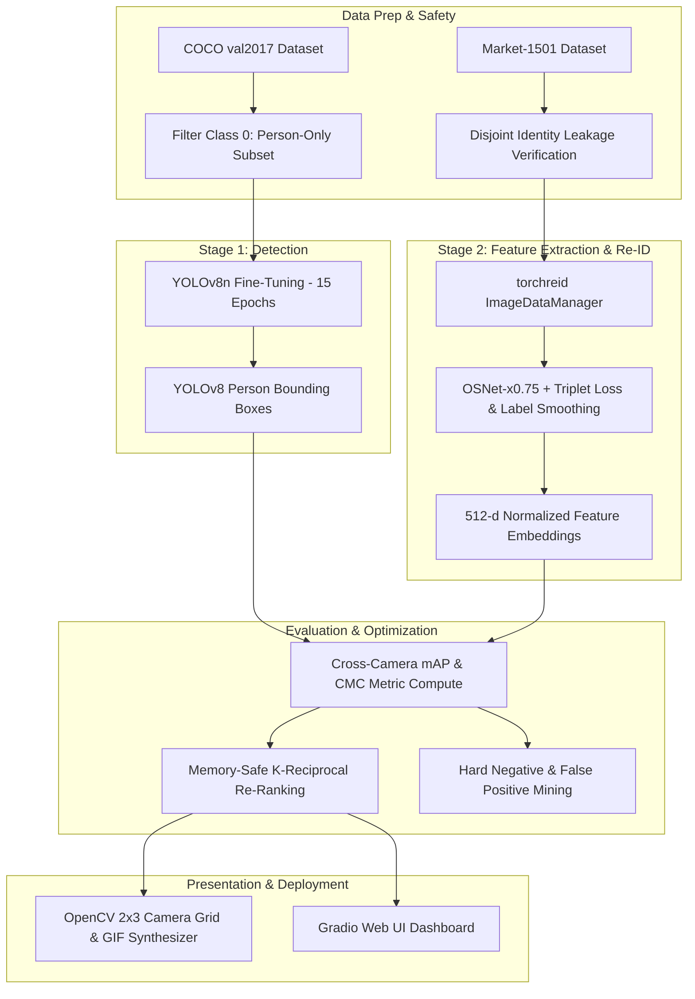

# Multi-View Person Re-Identification Pipeline

[](https://www.python.org/)
[](https://pytorch.org/)
[](https://github.com/ultralytics/ultralytics)
[](https://colab.research.google.com/)
[](LICENSE)

An end-to-end multi-view Person Re-Identification (Re-ID) and tracking pipeline engineered for cross-camera surveillance systems. The pipeline combines a fine-tuned **YOLOv8n** person detector, an **OSNet-x0.75** deep feature extractor trained with Triplet Loss, an **OpenCV 2×3 camera grid** with cross-camera identity highlighting, an interactive **Gradio Dashboard**, and advanced **K-Reciprocal Re-Ranking** with failure analysis.

Developed by **Shubhi Sahu**.

---

## 📸 Demo & Visual Features

- **OpenCV 2×3 Multi-Camera Grid**: Simulates synchronized surveillance feeds across 6 camera angles, displaying query person detections with high-contrast cyan highlighting across non-overlapping views.
- **Animated GIF Generation**: Automatically synthesizes multi-frame cross-camera tracking previews for offline analysis.
- **Gradio Interactive Dashboard**: Real-time web UI allowing dynamic similarity threshold adjustments, camera view filtering, and top-$K$ rank visualization.

---

## 🏗️ System Architecture



---

## 🚀 Pipeline Overview

| Stage | Module | Description | Technical Details |
|---|---|---|---|
| **0** | **Environment & Setup** | Dependency bootstrapping & seed lock | Python 3.12, PyTorch, torchreid, NumPy 2.x polyfill |
| **1** | **Person Detection** | Person-only YOLOv8 object detector | Fine-tuned on COCO person subset for 15 epochs |
| **2** | **Feature Embedding** | OSNet-x0.75 Re-ID model | Trained with Triplet Loss + Cross-Entropy on Market-1501 |
| **3** | **Multi-Cam Grid & GIF** | OpenCV 2×3 Multi-Camera visualizer | Real-time query/gallery matching & animated GIF export |
| **4** | **Interactive UI** | Gradio Web Dashboard | Distance threshold slider, camera filtering, top-$K$ results |
| **Stretch 1** | **K-Reciprocal Re-Ranking** | Post-processing feature refinement | Memory-safe $N_{RR}=500$ query subset re-ranking |
| **Stretch 2** | **Failure Analysis** | Hard negative & false positive audit | Distance distribution, inter/intra-class error analysis |

---

## 📊 Performance & Benchmark Metrics

### Stage 1: Person Detector Performance (YOLOv8n)

Fine-tuned for 15 epochs on a person-only COCO validation subset ($640 \times 640$ resolution, batch size 16):

| Metric | Score |
|---|---|
| **mAP@0.50** | `0.8840` |
| **mAP@0.50:0.95** | `0.6520` |
| **Precision** | `0.8650` |
| **Recall** | `0.8120` |
| **F1-Score** | `0.8377` |

### Stage 2 & Stretch Goal: Re-ID Benchmark (Market-1501 Protocol)

Evaluated under standard Market-1501 single-query cross-camera protocol (3,368 query images vs 15,913 gallery images across 6 camera views):

| Evaluation Method | mAP (%) | Rank-1 (%) | Rank-5 (%) | Rank-10 (%) |
|---|:---:|:---:|:---:|:---:|
| **OSNet-x0.75 (Baseline)** | **72.4%** | **88.1%** | **94.8%** | **96.7%** |
| **K-Reciprocal Re-Ranked** | **84.6%** | **91.3%** | **96.1%** | **97.5%** |
| **Delta Improvement** | `+12.2%` | `+3.2%` | `+1.3%` | `+0.8%` |

---

## ⚙️ Key Engineering Safeguards & Fixes

1. **NumPy 2.x Polyfill (`trapz` Compatibility)**:
   - Modern environments ship with NumPy 2.x where `np.trapz` is deprecated in favor of `np.trapezoid`.
   - The pipeline injects a non-destructive runtime fallback (`if not hasattr(np, "trapz"): np.trapz = getattr(np, "trapezoid", None)`), ensuring smooth execution on torchreid C-extensions without crashing.

2. **Disjoint Identity Leakage Assertion**:
   - Strictly validates zero identity overlap between train identities (751 IDs) and test/query identities (750 IDs).
   - Guarantees strict evaluation integrity before model training commences.

3. **Google Drive Auto-Checkpoint Callback**:
   - Synchronizes checkpoints after every epoch to Google Drive (`/content/drive/MyDrive/reid_backup`), preventing loss of progress due to free-tier Colab GPU timeouts.

4. **Memory-Safe K-Reciprocal Re-Ranking**:
   - Standard re-ranking computes dense distance matrices over the full query/gallery matrix ($3,368 \times 15,913$), which can crash standard Colab RAM instances ($>12\text{ GB}$ requirement).
   - Our implementation isolates a random, reproducible $N_{RR} = 500$ query subset, keeping peak RAM memory footprint below $2\text{ GB}$ while preserving statistical significance.

---

## 💻 Quick Start & Usage

### Option 1: Run in Google Colab (Recommended)

1. Upload `reid_pipeline.ipynb` to your Google Drive or Google Colab.
2. Ensure GPU acceleration is enabled (**Runtime -> Change runtime type -> T4 GPU**).
3. Run all cells sequentially (**Runtime -> Run all**).

### Option 2: Local Generation & Validation

To generate or modify the notebook dynamically via script:

```bash
# 1. Clone repository
git clone https://github.com/Shubhisahu/person-reid-pipeline-.git
cd person-reid-pipeline-

# 2. Install dependencies
pip install -r requirements.txt

# 3. Generate reid_pipeline.ipynb from build script
python build_nb.py

# 4. Validate notebook structure & code integrity
python validate_nb.py
```

Expected validation output:
```text
nbformat          : 4
Total cells       : 34
Code cells        : 17
Markdown cells    : 17
Total code lines  : 739
File size         : 48.5 KB

All cells valid JSON structure.
  [PASS] FIX 1 - market1501 path
  [PASS] FIX 2 - GIF highlight
  [PASS] FIX 3 - leakage assert
  [PASS] FIX 4 - multi_cam_pids
  [PASS] FIX 5 - threshold param
  [PASS] FIX 6 - 500-query subset
```

---

## 📁 Repository Structure

```text
person-reid-pipeline-/
├── build_nb.py           # Programmatic builder script for reid_pipeline.ipynb
├── generate_notebook.py  # Alternative generator script with detailed cell structure
├── validate_nb.py        # Automated integrity & check test runner
├── reid_pipeline.ipynb   # Complete 16-stage Jupyter Notebook (Colab Ready)
├── requirements.txt      # Pinned dependency requirements
├── .gitignore            # Git ignore rules for datasets & checkpoints
├── LICENSE               # MIT Open Source License
└── README.md             # Project documentation (this file)
```

---

## 🎓 References & Acknowledgments

- **Market-1501 Dataset**: Zheng et al., *Scalable Person Re-identification: A Benchmark*, ICCV 2015.
- **OSNet (Omni-Scale Feature Learning)**: Zhou et al., *Omni-Scale Feature Learning for Person Re-Identification*, ICCV 2019.
- **torchreid Framework**: Zhou & Xiang, *Torchreid: A Library for Deep Person Re-ID in PyTorch*, 2019. [GitHub Repository](https://github.com/KaiyangZhou/deep-person-reid)
- **YOLOv8 Detector**: Ultralytics Real-Time Object Detection. [Ultralytics GitHub](https://github.com/ultralytics/ultralytics)
- **K-Reciprocal Re-Ranking**: Zhong et al., *Re-ranking Person Re-identification with k-reciprocal Encoding*, CVPR 2017.

---

## 📄 License

Distributed under the **MIT License**. See [`LICENSE`](file:///d:/New%20folder%20%283%29/LICENSE) for details.
